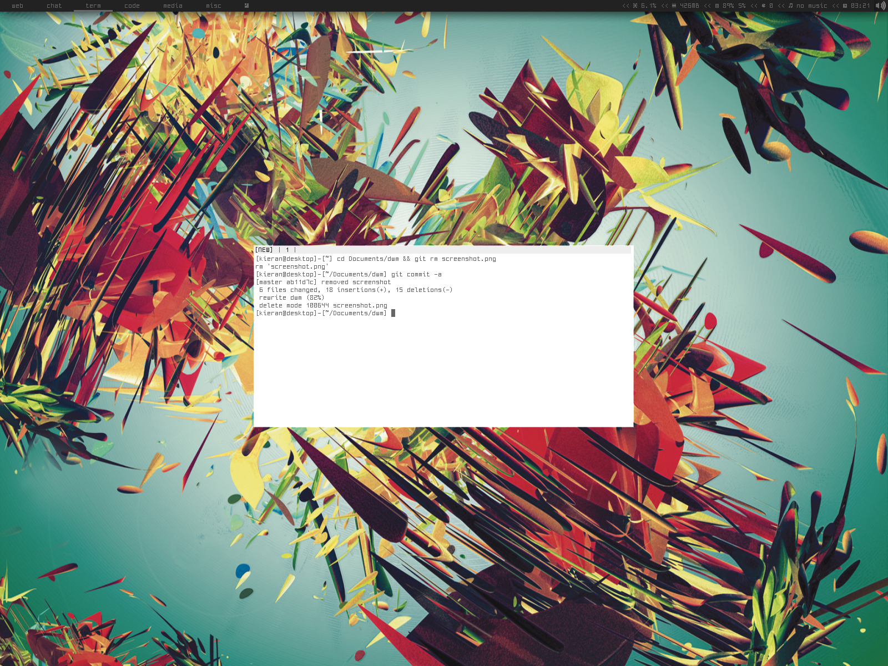

Requirements
------------
* Xlib header files
* ohsnap & terminus fonts

Instructions
------------

	git clone https://github.com/KieranQuinn/dwm.git
	cd dwm && sudo make clean install
	
	
What it includes
----------------
* statuscolors
* statusallmons
* centredfloating
* savefloats
* notitle
* pertag2
* systray
* occupiedcol
* uselessgaps
* keysymfix
* bstack
* runorraise
	
To do
-----
* re-write bar and text
	* systray bg colour fix
* monocle gaps?
* fix monocle to tile layout/resizing
* hardcode status bar (configurable via config.h)
* create better colouring system
	* underline
	* border
	* foreground
	* background
	* layout
	
Screenshot
----------

