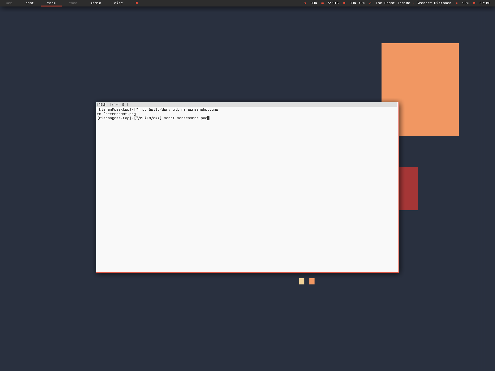

Requirements
------------
* Xlib header files
* stlarch & terminus fonts

Instructions
------------

	git clone https://github.com/KieranQuinn/dwm.git
	cd dwm && sudo make clean install

What it includes
----------------
* statuscolors
* centredfloating
* savefloats
* notitle
* pertag2
* systray
* occupiedcol
* uselessgaps
* bstack
* runorraise
	
To do
-----
* tag padding
* reload
* statusbar in C
* colouring
* clean/remove code

Screenshot
----------

